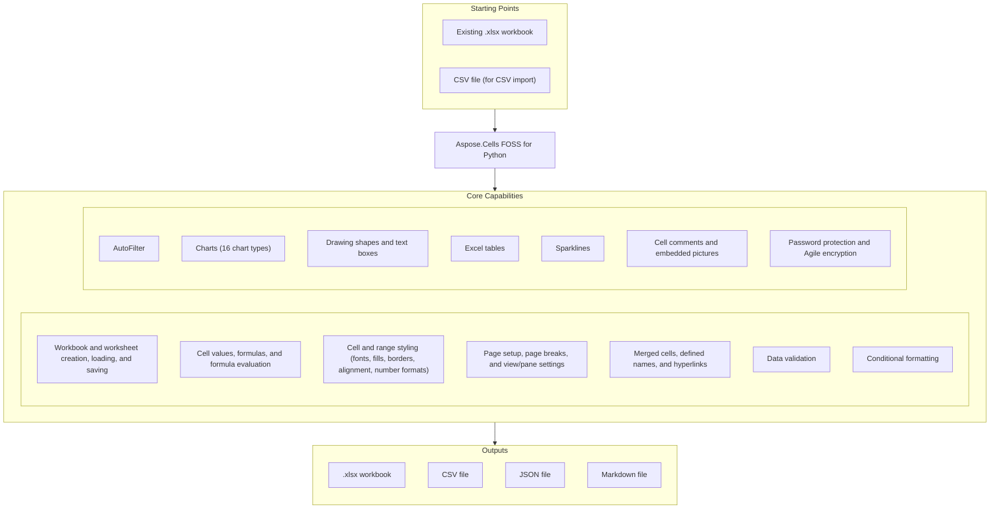

# Aspose.Cells FOSS for Python

[](https://pypi.org/project/aspose-cells-foss/) [](https://pypi.org/project/aspose-cells-foss/) [](License/LICENSE.txt) [](https://github.com/aspose-cells-foss/Aspose.Cells-FOSS-for-Python/graphs/contributors)

[](https://products.aspose.org/cells/python/)

Aspose.Cells FOSS for Python is a free, open-source, pure-Python library for creating, reading,
and modifying Excel `.xlsx` workbooks without requiring Microsoft Excel. It runs on Python 3.7 or
later and depends only on `pycryptodome` (AES encryption) and `olefile` (Compound File Binary
handling). It covers cell values and formulas, styling, data validation, conditional formatting,
auto filters, charts, drawing shapes, tables, sparklines, comments, embedded pictures, password
protection, and CSV/JSON/Markdown export.

## Navigation

- [At a Glance](#at-a-glance)
- [Key Capabilities](#key-capabilities)
- [Installation](#installation)
- [Quick Start](#quick-start)
- [Additional Examples](#additional-examples)
- [API Reference](#api-reference)
- [Documentation & Resources](#documentation--resources)
- [Scope and Limitations](#scope-and-limitations)
- [Development and Testing](#development-and-testing)
- [License](#license)

## At a Glance



## Key Capabilities

- The primary entry point is `Workbook`, used to create Excel files or edit and modify existing
  `.xlsx` files; it manages multiple worksheets — `add_worksheet()`, `remove_worksheet()`,
  `copy_worksheet()`, `get_active_worksheet()`, and `Worksheet.rename()` cover creating,
  removing, and renaming them. Each worksheet exposes a `cells` collection of `Cell` objects for
  reading and writing values and formulas, plus a basic `FormulaEvaluator` for cells without
  cached values.
- `Style` (via `Cell.get_style()`/`apply_style()`) carries fonts, fills, borders, alignment, text
  wrap/rotation, and number formats, including built-in Excel number-format codes.
- `PageSetup`, `PageMargins`, and horizontal/vertical page-break collections configure print
  layout, and `Pane` configures freeze/split panes.
- Merged cells (`Cells.merge()`/`merge_range()`), defined names (`DefinedNameCollection`), and
  hyperlinks (`Hyperlinks`) to URLs, email addresses, files, and internal references round-trip
  through load and save.
- `DataValidationCollection` applies data validation rules (dropdown lists, number ranges, custom
  formulas), and `ConditionalFormatCollection` applies rules-based formatting, both scoped to
  cell ranges.
- Filtering a worksheet range down to matching rows is handled by `AutoFilter`.
- `ChartCollection` creates and modifies all 16 real `ChartType` values (line, bar, pie, area,
  box-and-whisker, waterfall, combo, scatter, stock, surface, radar, treemap, sunburst,
  histogram, funnel, and map), each with its own dedicated XML writer.
- Rectangles, ovals, textboxes, arrows, and other preset shapes (`MsoDrawingType`) are added via
  `ShapeCollection`, while `TableCollection` creates, styles, and manages structured Excel tables
  (ECMA-376's ListObject) with auto-filters.
- `SparklineGroupCollection` manages sparklines — a data-source range paired with the cell where
  each one appears, grouped by shared visual style.
- Cell comments with author and rich text are added via `Cell.set_comment()`, and
  `PictureCollection` embeds images anchored to a cell range.
- Password-protecting a workbook AES-encrypts it (`XLSXEncryptor`, Agile encryption per ECMA-376
  Part 2 §4) via `Workbook.save(password=...)`, and `Workbook(path, password=...)` decrypts one on
  load; `WorkbookProtection`/`SheetProtection` lock workbook structure and individual sheets
  independently of encryption.
- `Workbook.save_as_csv()`/`load_csv()`, `save_as_json()`, and `save_as_markdown()` export/import
  workbook data in CSV, JSON, and Markdown text formats alongside native `.xlsx` I/O.

## Installation

```bash
pip install aspose-cells-foss
```

Requires Python 3.7 or later. Installs `pycryptodome` (>=3.15.0) and `olefile` (>=0.46) as
dependencies.

## Quick Start

Create a new workbook and save it:

```python
from aspose.cells_foss import Workbook

workbook = Workbook()
worksheet = workbook.worksheets[0]

worksheet.cells["A1"].value = "Hello"
worksheet.cells["B1"].value = "World"
worksheet.cells["A2"].value = 42
worksheet.cells["B2"].value = 3.14

workbook.save("output.xlsx")
```

Read an existing workbook:

```python
from aspose.cells_foss import Workbook

workbook = Workbook("input.xlsx")
worksheet = workbook.worksheets[0]

value = worksheet.cells["A1"].value
print(f"Cell A1 contains: {value}")
```

## Additional Examples

Apply cell styling:

```python
from aspose.cells_foss import Workbook

workbook = Workbook()
worksheet = workbook.worksheets[0]
cell = worksheet.cells["A1"]

cell.value = "Styled Text"

style = cell.get_style()
style.font.bold = True
style.font.color = "#FF0000"
style.font.size = 14
cell.apply_style(style)

workbook.save("styled.xlsx")
```

<details>
<summary>View Additional Examples</summary>

### Add Data Validation (Dropdown List)

```python
from aspose.cells_foss import Workbook, DataValidationType

workbook = Workbook()
worksheet = workbook.worksheets[0]

validation = worksheet.data_validations.add("A1:A10")
validation.type = DataValidationType.LIST
validation.formula1 = '"Option1,Option2,Option3"'

workbook.save("validation.xlsx")
```

### Export to CSV

```python
from aspose.cells_foss import Workbook

workbook = Workbook("input.xlsx")
workbook.save_as_csv("output.csv")
```

### Password-Protect a Workbook

```python
from aspose.cells_foss import Workbook

workbook = Workbook()
worksheet = workbook.worksheets[0]
worksheet.cells["A1"].value = "Confidential Data"

workbook.save("protected.xlsx", password="mypassword")

workbook2 = Workbook("protected.xlsx", password="mypassword")
```

</details>

## API Reference

The public entry point is the `aspose.cells_foss` package (import: `from aspose.cells_foss import
Workbook`). The classes below cover the full supported public API surface — 130 public types
organized into one module.

<details>
<summary>View the Supported Public API Surface</summary>

### Core API

| Class | Description |
|---|---|
| `AgileEncryptionParameters` | Parameters for Agile Encryption (ECMA-376 Part 2, Section 4). |
| `Alignment` | Represents alignment settings for a cell or range of cells. |
| `AutoFilter` | Represents auto filters in a worksheet. |
| `AutoFilterXMLLoader` | Handles loading autofilter data from XML format for .xlsx files. |
| `AutoFilterXMLWriter` | Handles writing autofilter data to XML format for .xlsx files. |
| `Border` | Represents border settings for a single side of a cell or range of cells. |
| `Borders` | Represents border settings for all sides of a cell or range of cells. |
| `CFBReader` | Reads encrypted XLSX from CFB format. |
| `CFBWriter` | Writes CFB (Compound File Binary) files according to MS-CFB specification. |
| `CFBWriter-cfb_handler` | Writes encrypted XLSX to CFB format (a distinct `CFBWriter` class in `cfb_handler.py`, not the general-purpose one above). |
| `CSVHandler` | Handles CSV import and export operations for workbooks. |
| `CSVLoadOptions` | Options for loading CSV files. |
| `CSVSaveOptions` | Options for saving CSV files. |
| `CalculationProperties` | Represents calculation properties for the workbook. |
| `Cell` | Represents a single cell in a worksheet. |
| `CellValueHandler` | Handles cell value import and export operations according to ECMA-376 specification. |
| `Cells` | Represents a collection of cells in a worksheet. |
| `Chart` | Represents a chart in a worksheet. |
| `ChartAxis` | Represents a chart axis (category, value, or series). |
| `ChartCollection` | Collection of charts in a worksheet. |
| `ChartErrorBars` | Represents error bars attached to a chart series. |
| `ChartSeries` | Represents a single chart series. |
| `ChartView3D` | Represents chart-level 3D view settings. |
| `ChartXmlLoader` | Loads worksheet chart settings from drawing/chart XML parts. |
| `ChartXmlSaver` | Handles writing chart-related XLSX parts:. |
| `CommentXMLReader` | Handles reading comment data from XML format. |
| `CommentXMLWriter` | Handles writing comment data to XML format. |
| `ConditionalFormat` | Represents a single conditional formatting rule applied to a cell range. |
| `ConditionalFormatCollection` | Represents a collection of conditional formats for a worksheet. |
| `ConditionalFormatXMLLoader` | Handles loading conditional formatting data from XML format for .xlsx files. |
| `ConditionalFormatXMLWriter` | Handles writing conditional formatting data to XML format for .xlsx files. |
| `CoreProperties` | Represents core document properties stored in docProps/core.xml. |
| `DataValidation` | Represents data validation settings for a range of cells. |
| `DataValidationCollection` | Represents a collection of DataValidation objects for a worksheet. |
| `DataValidationXmlLoader` | Loads DataValidation objects from ECMA-376 SpreadsheetML XML format. |
| `DataValidationXmlSaver` | Saves DataValidation objects to ECMA-376 SpreadsheetML XML format. |
| `DefinedName` | Represents a defined name in the workbook. |
| `DefinedNameCollection` | Collection of defined names in the workbook. |
| `DocumentProperties` | Container for all document-level properties. |
| `EncryptionParameters` | Base class for encryption parameters. |
| `EncryptionVerifier` | Encryption verifier generation and validation. |
| `ExtendedProperties` | Represents extended/application properties stored in docProps/app.xml. |
| `FileVersion` | Represents file version information for the workbook. |
| `Fill` | Represents fill settings for a cell or range of cells. |
| `FilterColumn` | Represents a filter column in an auto filter. |
| `Font` | Represents font settings for a cell or range of cells. |
| `FormulaEvaluator` | Basic formula evaluator for XLSX cells without cached values. |
| `HeaderFooter` | Represents header and footer settings. |
| `HorizontalPageBreakCollection` | Collection of manual horizontal page breaks (row breaks). |
| `Hyperlink` | Represents a hyperlink in a worksheet. |
| `HyperlinkRelationshipWriter` | Writes hyperlink relationships to _rels files. |
| `HyperlinkXMLLoader` | Loads hyperlinks from worksheet XML and relationship files. |
| `HyperlinkXMLSaver` | Saves hyperlinks to worksheet XML and relationship files. |
| `Hyperlinks` | Collection of hyperlinks in a worksheet. |
| `JsonHandler` | Handles JSON export operations for workbooks. |
| `JsonSaveOptions` | Options for saving JSON files. |
| `MarkdownHandler` | Handles Markdown export operations for workbooks. |
| `MarkdownSaveOptions` | Options for saving Markdown files. |
| `MinimalCFBWriter` | Minimal CFB file writer for encrypted Office documents. |
| `MsoFillFormat` | Fill format properties for a shape. |
| `MsoLineFormat` | Border/outline format properties for a shape. |
| `NSeries` | Collection of series for a chart. |
| `NumberFormat` | Represents number format settings for a cell or range of cells. |
| `PackageEncryption` | Package data encryption and decryption. |
| `PageMargins` | Represents page margins. |
| `PageSetup` | Represents page setup settings. |
| `Pane` | Represents pane (freeze/split) settings. |
| `PasswordDerivation` | Password derivation helpers for Agile encryption. |
| `Picture` | Represents a worksheet picture anchored to cells. |
| `PictureCollection` | Collection of pictures in a worksheet. |
| `PictureXmlLoader` | Loads pictures from worksheet drawing parts. |
| `PictureXmlSaver` | Handles writing picture-related drawing/media XML payloads. |
| `PrintOptions` | Represents print options. |
| `Protection` | Represents protection settings for a cell or range of cells. |
| `Selection` | Represents cell selection in a sheet view. |
| `Shape` | Represents a drawing shape (rectangle, oval, text box, arrow, etc.) on a worksheet. |
| `ShapeCollection` | Collection of Shape objects on a worksheet. |
| `ShapeFont` | Font properties for text inside a shape. |
| `ShapeXmlLoader` | Loads xdr:sp shape elements from a drawing XML part. |
| `ShapeXmlSaver` | Generates drawing XML and relationship XML for worksheet shapes. |
| `SharedStringTable` | Manages the Shared String Table for XLSX files according to ECMA-376 specification. |
| `SheetFormatProperties` | Represents sheet format properties. |
| `SheetProtection` | Represents sheet protection settings. |
| `SheetProtectionDictWrapper` | Dictionary-like wrapper around SheetProtection for backward compatibility. |
| `SheetView` | Represents a sheet view configuration. |
| `Sparkline` | One sparkline: a data source range paired with the cell where it appears. |
| `SparklineGroup` | A group of sparklines that share the same visual style. |
| `SparklineGroupCollection` | Collection of SparklineGroup objects (ws.sparkline_groups). |
| `SparklineXmlLoader` | Loads sparkline group data from the in a worksheet XML root. |
| `SparklineXmlSaver` | Serialises SparklineGroupCollection to XML. |
| `StandardEncryptionParameters` | Parameters for Standard Encryption (ECMA-376 Part 2, Section 3). |
| `Style` | Represents formatting settings for a cell or range of cells. |
| `Table` | Represents an Excel structured table (ECMA-376 §18.5). |
| `TableCollection` | Collection of Table objects belonging to a worksheet (ws.tables). |
| `TableColumn` | Settings for a single table column. |
| `TableStyleInfo` | Visual style settings for an Excel table. |
| `TableXmlLoader` | Loads table definitions from an XLSX ZIP archive into a worksheet. |
| `TableXmlSaver` | Serialises Table objects to ECMA-376 table XML. |
| `VerticalPageBreakCollection` | Collection of manual vertical page breaks (column breaks). |
| `Workbook` | Represents an Excel workbook. |
| `WorkbookPr` | Represents workbook properties (workbookPr element). |
| `WorkbookProperties` | Container for all workbook-level properties. |
| `WorkbookPropertiesXMLLoader` | Handles loading workbook properties from XML format for .xlsx files. |
| `WorkbookPropertiesXMLWriter` | Handles writing workbook properties to XML format for .xlsx files. |
| `WorkbookProtection` | Represents workbook protection settings. |
| `WorkbookView` | Represents a workbook view configuration. |
| `Worksheet` | Represents a single worksheet in an Excel workbook. |
| `WorksheetProperties` | Container for all worksheet-level properties. |
| `WorksheetPropertiesXMLLoader` | Handles loading worksheet properties from XML format for .xlsx files. |
| `WorksheetPropertiesXMLWriter` | Handles writing worksheet properties to XML format for .xlsx files. |
| `XLSXDecryptor` | Handles decryption of XLSX files. |
| `XLSXEncryptor` | Handles encryption of XLSX files. |
| `XMLLoader` | Handles loading of Excel workbook XML files. |
| `XMLSaver` | Handles saving workbook data to XML format for .xlsx files. |

#### Enumerations

| Enumeration | Description |
|---|---|
| `ChartType` | Supported chart types. |
| `CipherAlgorithm` | Cipher algorithm enumeration. |
| `DataValidationAlertStyle` | Specifies the style of the error alert displayed when invalid data is entered. |
| `DataValidationImeMode` | Specifies the Input Method Editor (IME) mode for CJK language input. |
| `DataValidationOperator` | Specifies the comparison operator for data validation. |
| `DataValidationType` | Specifies the type of data validation. |
| `EncryptionType` | Encryption type enumeration. |
| `FillType` | Shape fill type (ECMA-376 a:spPr fill child elements). |
| `HashAlgorithm` | Hash algorithm enumeration. |
| `MsoDrawingType` | Shape preset geometry types (maps to ECMA-376 a:prstGeom prst attributes). |
| `MsoLineDashStyle` | Shape border/line dash style (ECMA-376 a:prstDash val attribute). |
| `SaveFormat` | Specifies the format for saving a workbook. |
| `SparklineEmptyCells` | How a sparkline handles empty cells in its data range: `ZERO`, `GAP`, or `CONNECTED`. |
| `SparklineType` | The visual form of a sparkline: `LINE`, `COLUMN`, or `WIN_LOSS`. |
| `TextAlignmentType` | Horizontal text alignment inside a shape (ECMA-376 a:pPr algn attribute). |
| `TextAnchorType` | Vertical text anchor inside a shape (ECMA-376 a:bodyPr anchor attribute). |

</details>

## Documentation & Resources

- **[Getting started guide](https://docs.aspose.org/cells/python/)** — Python documentation for Aspose.Cells FOSS: workbook creation, cell operations, styling, and data validation.
- **[How-to guides & FAQ](https://kb.aspose.org/cells/python/)** — Python knowledge base for Aspose.Cells FOSS: how-to articles, FAQ, and troubleshooting guides.
- **[Full API reference](https://reference.aspose.org/cells/python/)** — the complete, browsable reference for all 130 public types (the [API reference](#api-reference) section above covers the essentials).
- More examples live in the repository's [`examples`](examples) directory.
- **[Contributor guide](AGENTS.md)** — architecture notes and conventions for contributors.
- Found a bug or have a feature request? [Open an issue](https://github.com/aspose-cells-foss/Aspose.Cells-FOSS-for-Python/issues) on GitHub.

## Scope and Limitations

- Only `.xlsx` is supported for native load/save; CSV, JSON, and Markdown are additional
  text-format export targets (CSV also supports import), not general spreadsheet formats.
- Only Agile encryption (ECMA-376 Part 2, Section 4) is supported for reading and writing
  password-protected workbooks; Standard encryption (Section 3) is not yet supported for reading.
- `FormulaEvaluator` is a basic evaluator for cells without cached values — this is not a full
  spreadsheet calculation engine.

These limitations don't apply to
[Aspose.Cells for Python — Enterprise Edition](https://products.aspose.com/cells/python-java/),
which adds a full formula calculation engine, Standard encryption support, additional
spreadsheet formats, and dedicated enterprise support.

## Development and Testing

Install the development dependencies and run the test suite:

```bash
pip install -e ".[dev]"
pytest
```

## License

This project is licensed under the [MIT License](License/LICENSE.txt). The MIT License permits
use, copying, modification, distribution, sublicensing, and commercial use, provided its
copyright and permission notice are retained. The software is provided without warranty.
