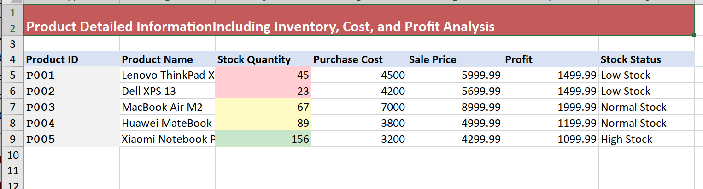

# Aspose.Cells MarkItDown Plugin

Enhanced Excel-to-Markdown conversion plugin for Microsoft MarkItDown, providing improved formatting capabilities.

## Overview

This plugin integrates Aspose.Cells.Python with [Microsoft MarkItDown](https://github.com/microsoft/markitdown) to deliver enhanced Excel-to-Markdown conversion with:

- **Hyperlink preservation** with proper Markdown link formatting
- **Clean table structure** without empty columns/rows
- **Enhanced metadata support** and professional formatting
- **Configurable conversion parameters** for customized output

## Installation

```bash
# Install from source with MarkItDown plugin support
pip install -e .[markitdown]
```

## Quick Start

### Command Line Usage

```bash
# Convert Excel file using our plugin
markitdown --use-plugins spreadsheet.xlsx -o output.md

# List available plugins
markitdown --list-plugins
```

### Python API Usage

```python
from markitdown import MarkItDown

# Initialize with plugins enabled
md = MarkItDown(enable_plugins=True)

# Convert Excel file - plugin automatically registered
result = md.convert("spreadsheet.xlsx")
print(result.text_content)
```

## Configuration Parameters

The plugin supports flexible configuration for customized conversion:

```python
result = md.convert("spreadsheet.xlsx",
    sheet_name=None,           # Convert specific sheet by name (None = all sheets)
    include_metadata=True,     # Include workbook metadata in output
    value_mode="value",        # "value" (calculated results) or "formula" (formulas)
    include_hyperlinks=True,   # Convert Excel hyperlinks to Markdown links
    include_generator_info=False  # Add plugin identification banner
)
```

### Parameter Details

| Parameter | Type | Default | Description |
|-----------|------|---------|-------------|
| `sheet_name` | str\|None | None | Convert only specified sheet. When None, converts all sheets. |
| `include_metadata` | bool | True | Include workbook metadata such as conversion date, sheet count, and sheet names. |
| `value_mode` | str | "value" | Control cell content: "value" shows calculated results, "formula" shows raw formulas. |
| `include_hyperlinks` | bool | True | Convert Excel hyperlinks to proper Markdown `[text](url)` syntax. |
| `include_generator_info` | bool | False | Add HTML comment identifying conversion by Aspose plugin. |

## Usage Examples

### Convert Specific Sheet
```python
result = md.convert("workbook.xlsx",
    sheet_name="Summary"      # Only convert the "Summary" sheet
)
```

### Minimal Output (Data-Only)
```python
result = md.convert("data.xlsx",
    include_metadata=False,
    include_hyperlinks=False,
    include_generator_info=False
)
```

### Formula Documentation
```python
result = md.convert("calculations.xlsx",
    value_mode="formula",     # Show formulas instead of calculated values
    include_metadata=True
)
```

## Output Quality Comparison

**Original Excel File:**


### Default MarkItDown Output
```markdown
| Product Detailed Information Including Inventory, Cost, and Profit Analysis | Unnamed: 1 | Unnamed: 2 | Unnamed: 3 | Unnamed: 4 | Unnamed: 5 | Unnamed: 6 |
| --- | --- | --- | --- | --- | --- | --- |
| NaN | NaN | NaN | NaN | NaN | NaN | NaN |
| P001 | Lenovo ThinkPad X1 | 45 | 4500 | 5999.99 | 1499.99 | Low Stock |
```

### Aspose Plugin Output
```markdown
## Product Details

| Product ID | Product Name | Stock Quantity | Purchase Cost | Sale Price | Profit | Stock Status |
| --- | --- | --- | --- | --- | --- | --- |
| P001 | [Lenovo ThinkPad X1](https://www.lenovo.com/thinkpad-x1) | 45 | 4500 | 5,999.99 | 1,499.99 | Low Stock |
```

*Notice the preserved hyperlinks, clean formatting, and eliminated empty columns.*

## Features

- **Multi-sheet Processing**: Convert all sheets or target specific sheets by name
- **Professional Table Formatting**: Clean headers and proper alignment
- **Hyperlink Preservation**: Converts Excel hyperlinks to Markdown link syntax
- **Metadata Support**: Optional inclusion of document metadata and conversion info
- **Flexible Output**: Choose between calculated values or raw formulas

## Technical Details

The plugin automatically registers with MarkItDown through setuptools entry points:

```toml
[project.entry-points."markitdown.plugin"]
aspose-cells-python = "aspose.cells.plugins.markitdown_plugin"
```

## Supported Formats

- **Input**: Excel files (.xlsx only)
- **Output**: Markdown via MarkItDown

## Requirements

- Python 3.8+
- markitdown>=0.1.0
- aspose-cells-python

## License

Part of [Aspose.Cells.Python](../../) under the Aspose Split License Agreement.